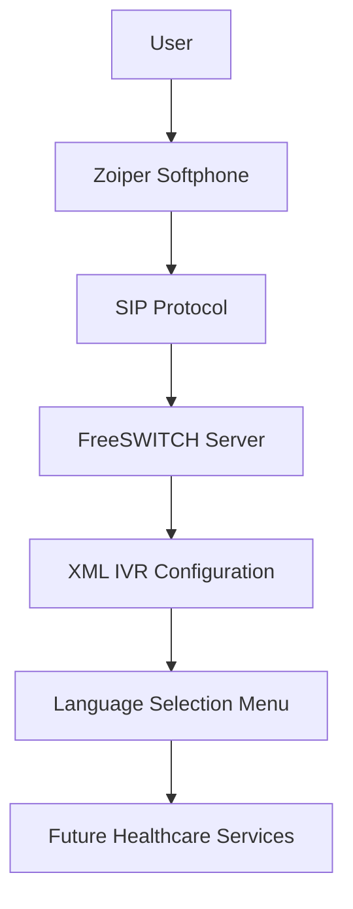
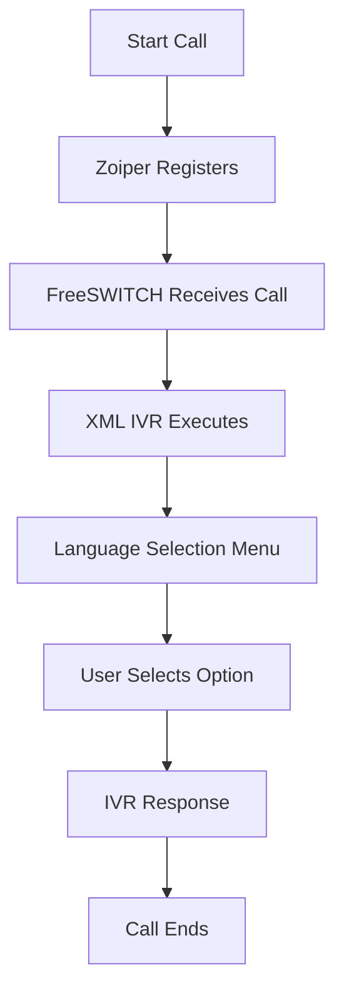

# 🩺 Sanjeevani – AI-Powered Rural Telemedicine Solution

> **Smart India Hackathon Project | IVR Module Documentation**

---

## Overview

Sanjeevani is a proof-of-concept telemedicine solution developed during the **Smart India Hackathon** for the **"Telemedicine Access for Rural Healthcare in Nabha"** problem statement.

The proposed solution aimed to improve healthcare accessibility for rural communities by combining:

- 🌐 A web-based telemedicine platform
- 🤖 An AI-powered virtual healthcare assistant
- ☎️ An Interactive Voice Response (IVR) system for users without smartphones or reliable internet access

As part of a **5-member team**, my primary responsibility was developing and configuring the **IVR module**, enabling users to interact with the healthcare system through voice calls.

---

## Problem Statement

Many rural communities face challenges in accessing healthcare services due to:

- Limited internet connectivity
- Lack of smartphones
- Limited digital literacy
- Difficulty accessing telemedicine platforms

Our solution proposed multiple access methods so that healthcare services could be reached through both web and voice-based interfaces.

---

## My Contribution

I was responsible for developing the **IVR (Interactive Voice Response) module** of the project.

My work included:

- Installing and configuring **FreeSWITCH** on macOS.
- Configuring **Zoiper** as the SIP softphone.
- Establishing SIP communication using IP configuration.
- Assisting in configuring XML-based IVR logic.
- Implementing a prototype language selection menu.
- Testing end-to-end IVR call routing.
- Participating in the final Smart India Hackathon project presentation.

---

## Technologies Used

- FreeSWITCH
- Zoiper Softphone
- XML
- SIP Protocol
- macOS Terminal

---

## IVR Workflow

1. User places a call using Zoiper.
2. FreeSWITCH receives the SIP call.
3. XML configuration processes the incoming request.
4. The IVR plays the language selection menu.
5. User selects an option using the phone keypad.
6. The configured IVR logic processes the request.

---

## System Architecture

---

## Call Flow

---

## Features Implemented

- Configured FreeSWITCH PBX server.
- Configured Zoiper as a SIP client.
- Established SIP communication between the server and softphone.
- Implemented a prototype IVR using XML configuration.
- Demonstrated a working language selection menu.
- Successfully tested IVR call routing.
- Presented the working prototype during Smart India Hackathon.

---

## Future Enhancements

The complete project vision included:

- AI-powered healthcare assistant
- Online doctor consultation
- Appointment booking
- Emergency healthcare services
- Hospital database integration
- Electronic Health Records (EHR)
- SMS notifications
- Multilingual IVR
- Voice recognition support

---

## Team

Developed by a **team of five members** during the Smart India Hackathon.

---

## Project Status

Prototype completed during the Smart India Hackathon.

This repository documents my contribution to the IVR module of the overall telemedicine solution.
